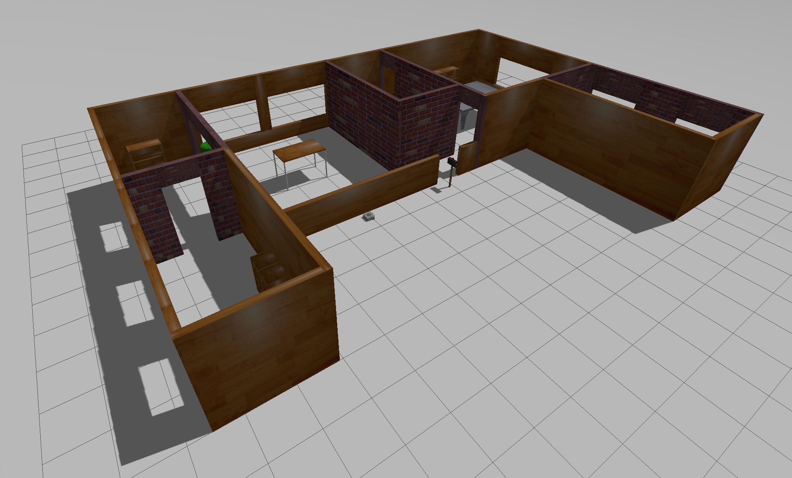
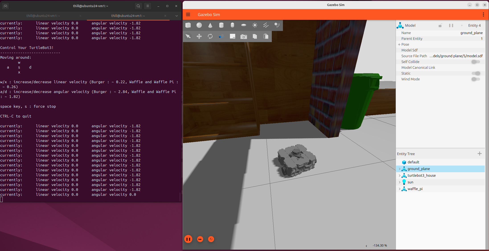

# tutorial5 - turtlebot3-simulations - ros2_workshop

## Overview
ROS Assignment 5 - Complete Tutorial 5: Turtlebot3 Simulations 

## Tutorial
Follow the video tutorial for installing Gazebo Ionic and Turtlebot3 Simulations in your Ubuntu 24 virtual machine and complete the basic turtlebot3 exercises.

## Summary of commands
The following commands were entered in the video tutorial5 

Install Gazebo Ionic (recommended version for ROS Kilted) from osrf binaries
GAZEBO MAY BE PREVIOUSLY INSTALLED, TRY SKIPPING THIS STEP
```
  sudo apt-get update
  sudo apt-get install curl lsb-release gnupg
  sudo curl https://packages.osrfoundation.org/gazebo.gpg --output /usr/share/keyrings/pkgs-osrf-archive-keyring.gpg
  echo "deb [arch=$(dpkg --print-architecture) signed-by=/usr/share/keyrings/pkgs-osrf-archive-keyring.gpg] https://packages.osrfoundation.org/gazebo/ubuntu-stable $(lsb_release -cs) main" | sudo tee /etc/apt/sources.list.d/gazebo-stable.list > /dev/null
  sudo apt-get update
  sudo apt-get install gz-ionic
```
Test the simulation program installed correctly
```
  gz sim
```

Install Turtlebot3 Simulations package from ros2 binaries
```
  sudo apt update
  sudo apt install ros-kilted-turtlebot3 ros-kilted-turtlebot3-msgs ros-kilted-turtlebot3-simulations
```
Set the robot model, edit ~/.bashrc to change
```
echo "export TURTLEBOT3_MODEL=waffle_pi" >> ~/.bashrc
source ~/.bashrc
```

Test the turtlebot3 simulation 
```
  ros2 launch turtlebot3_gazebo turtlebot3_house.launch.py
```
The Gazebo window should open and the walls of a house are shown.
 

Open a new terminal (or tab), start a keyboard node to drive robot
```
  ros2 run turtlebot3_teleop teleop_keyboard
```

Adjust settings for performance
Depending on the system, the reponse to commands may be slow and the display may be difficult to adjust due to lag. To make the simulator run smoothly, consider using the following settings.

 - If using a VM and the screen is flashing, shutdown the VM and uncheck "accelerate 3D graphics" or similar setting in the VM display settings. Increase the VM RAM to max reccomended leaving enough to run the host machine.

 - When the Gazebo window first opens, expand 'physics' in menu to the right and adjust the step-size up. Try 0.005 or 0.01 instead of the default 0.001

 - In the entity tree to the bottom right, click on 'Sun' and expand the 'light' menu above. Scroll down in the menu or drag the split screen down and disable 'Cast shadows'.

If the simulator is usable, drive the robot into the house using the keyboard. Take a screen capture of the Gazebo window showing the robot in the house, include the terminal with the keyboard node in the screen caputure image. 
 

## Deliverable 
Write a brief summary (1-2 paragraphs) on what you have accomplished and what you struggled with. Include an image that shows both the robot in the house and the keyboard terminal. Submit your work as a single .pdf document
